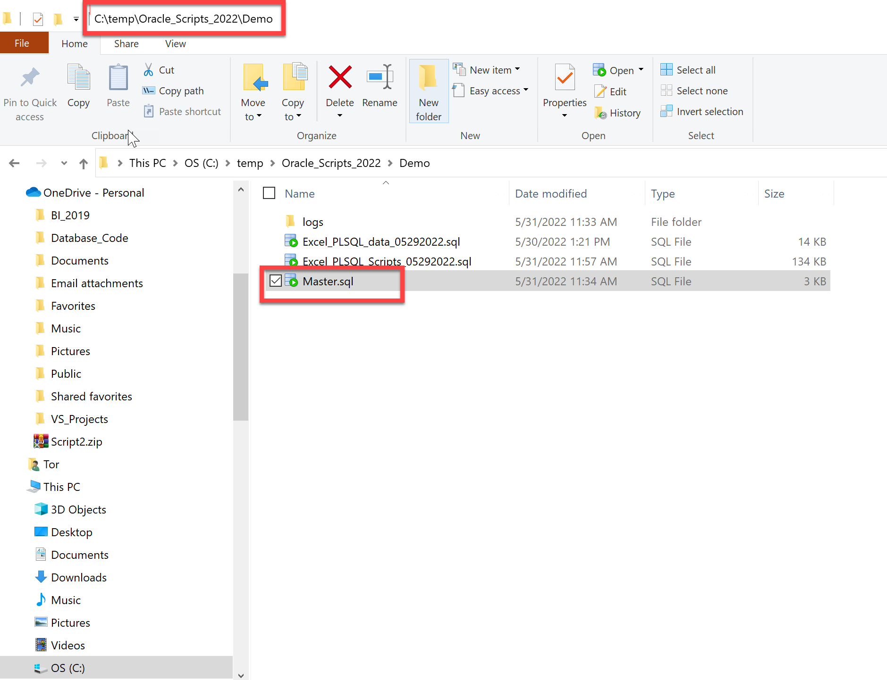
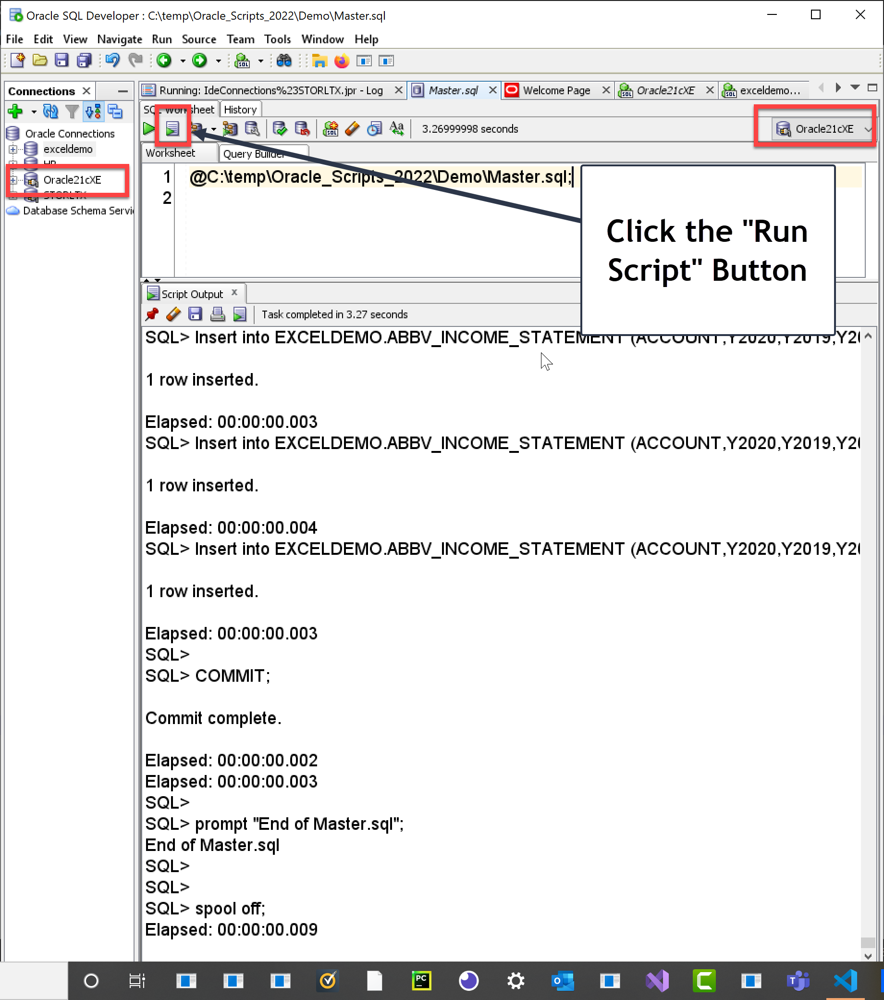
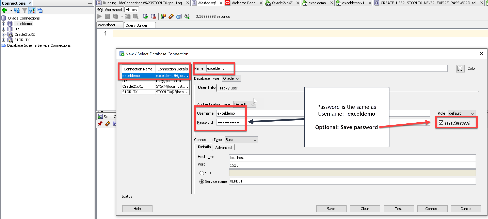
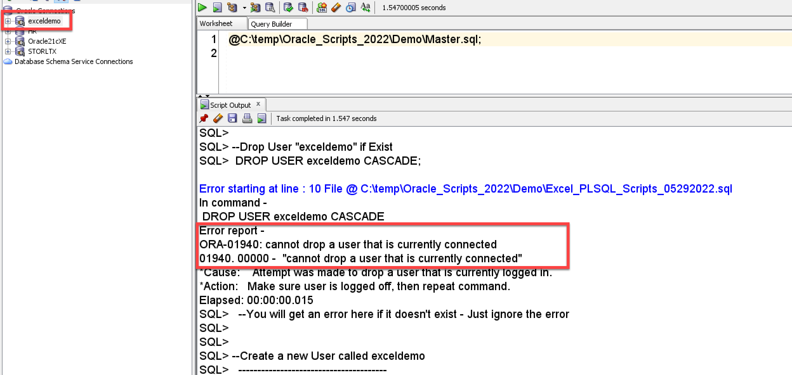
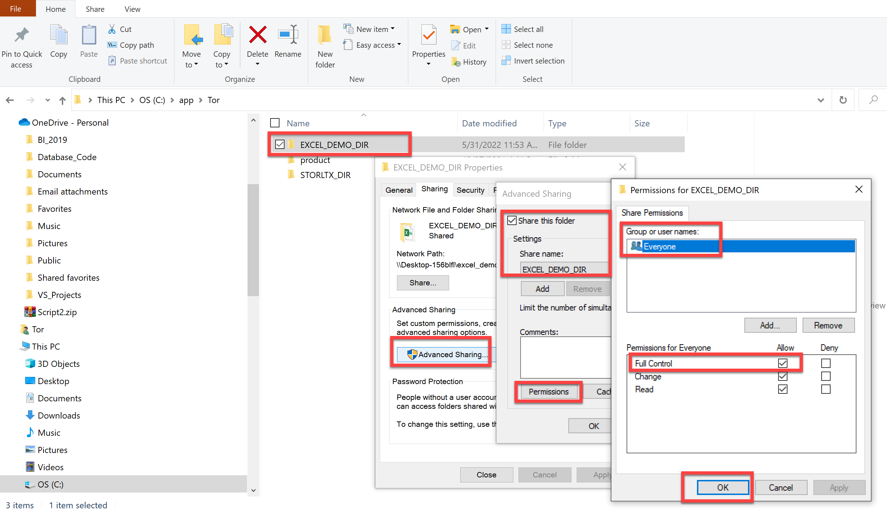

# Export Excel From Oracle
 
<h3>This repository accompanies the YouTube video:</h3>  
[Oracle Excel Export](https://youtu.be/eRCA2tMX5c8)  
<h3>by Tor Storli (May 30, 2022).</h3>

## Create the **exceldemo** Oracle Schema

I have included three scripts that will set up and create your <h3>**exceldemo**</h3> Oracle schema.  
The scripts does the following:
1. Create exceldemo User
2. Create a Directory
3. Grant user rights on Directory 
4. Create Database Objects
5. Create Grants on Objects
6. Create Tables
7. Populate Tables with Data
 

<h3> NOTE:  <b>The scripts has been tested in SQL Developer only. If you prefer to use SQLPlus, you will need to make changes to the scripts yourself.</b>
  

## Running the scripts:

1. Navigate to the folder you placed the three (3) script files

2. Copy Location address and append the Master.sql to the address.
3. Prefix a "@" to the address
4. In my example it looks like this:  @C:\temp\Oracle_Scripts_2022\Demo\Master.sql;

  
5. In Sql Developer - Login as **SYSTEM** user.  Place the above text (4. above) in an empty query window and click the "Run Script" button to start (See screenshot below).
  

  

## View **exceldemo** schema in SQL Developer:

1. Create a new connection in SQL Developer.
2. Populate the connection information
3. Add password:  **exceldemo**

*See screenshot below:*
  
 

## Re-Running the scripts:

If you get an error, make changes to the scripts as needed and run the Master script again as stated in the section above.
Make sure to disconnect the exceldemo user session before you try to run the scripts again, otherwise you will get an error when you try to recreate the user (See screenshot below).

 

## Create a Oracle Fileshare Directory

 
<h3><u>WINDOWS 10:</u></h3> 

Create a new folder on the path you choose for the ORACLE Directory.

i.e. <h3>*"C:\app\Tor\EXCEL_DEMO_DIR"*</h3>  

1. Right click on the EXCEL_DEMO_DIR folder.
2. Click the "Advanced Sharing" button on the Sharing Tab.
3. Check the "Share this Folder" checkbox on the "Advanced Sharing" Dialog box,   then click the "Permissions" button.
4. Select "Everyone" and check the "Full Control - Allow" checkbox, click "OK" 
   to finalize.   
   <i>See screenshot below...</i>  
 

## Create Oracle Directory - Additional Information:

You must have CREATE ANY DIRECTORY system privilege to create directories.

When you create a directory, you are automatically granted the READ and WRITE object privileges on the directory, 
and you can grant these privileges to other users and roles. The DBA can also grant these privileges to other users and roles.

WRITE privileges on a directory are useful in connection with external tables. 
They let the grantee determine whether the external table agent can write a log file or a bad file to the directory.

For file storage, you must also create a corresponding operating system directory, an ASM disk group, or a directory within an ASM disk group. 
Your system or database administrator must ensure that the operating system directory has the correct read and write permissions for Oracle Database processes.

Privileges granted for the directory are created independently of the permissions defined for the operating system directory, 
and the two may or may not correspond exactly. For example, an error occurs if sample user hr is granted READ privilege on the directory object 
but the corresponding operating system directory does not have READ permission defined for Oracle Database processes.

<i><b>Source:</b> 
Oracle Package: AS_XLSX  
Author: Anton Scheffer 
Date: 19-02-2011 
Website: http://technology.amis.nl/blog 
See also: http://technology.amis.nl/blog/?p=10995</i> 
AS_XLSX: https://technology.amis.nl/languages/oracle-plsql/create-an-excel-file-with-plsql/<i>